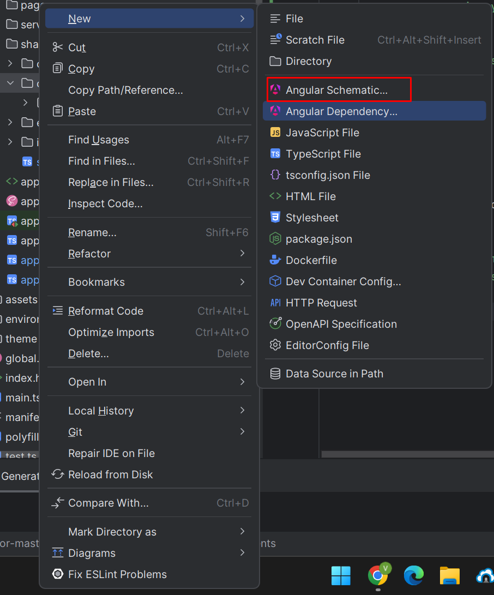

# ilo-career-advisor-master
IOL App Hướng Nghiệp

# 1. Cài đặt môi trường phát triển
1. [Nodejs](https://nodejs.org/en/download): ^19.0.0
2. Angular CLI: <code>npm i -g @angular/cli</code>
3. Ionic Tooling: <code>npm install -g @ionic/cli native-run cordova-res</code>
4. [Git](https://git-scm.com/downloads) (GitHub)
5. Editor: [WebStorm](https://www.jetbrains.com/webstorm/)
6. Thiết lập run configurations

# 2. Cấu trúc thư mục
    src/
    ├── app/
    │   ├── core/                  # Core module (services, guards, directives, pipes etc.)
    │   ├── pages/                 # Pages
    │   ├── services/              # Feature services
    │   ├── shared/                # Shared module (components, class, constans, interface, enums)
    │   ├── app.component.html
    │   ├── app.component.scss
    │   ├── app.component.ts
    │   ├── app.component.spec.ts
    │   ├── app-routing.module.ts
    │   └── app.module.ts
    ├── environments/               # Cấu hình môi trường
    ├── assets/                     # Tài nguyên (ảnh, font, v.v.)
    └── theme/                      # Global styles (Tailwind config, utilities)

# 3. Cấu hình Tailwind CSS
* Sử dụng theme trong tailwind.config.js để tránh lặp lại code:

      module.exports = {
            theme: {
                extend: {
                    colors: {
                      primary: '#1D4ED8',
                      secondary: '#9333EA',
                    },
                    spacing: {
                      '128': '32rem',
                      '144': '36rem',
                    },
                 },
            },
            plugins: [],
      };

* Sử dụng @apply cho các lớp CSS tái sử dụng nhiều lần:

      /* styles/tailwind-utilities.scss */
      .btn-primary {
          @apply bg-primary text-white px-4 py-2 rounded;
      }
      .card {
          @apply bg-white shadow-md p-4 rounded-lg;
      }

# 3. Quy tắc đặt tên
## 3.1 Component

* Tên file: Sử dụng kebab-case.

      example.component.ts
      example.component.html
      example.component.scss

* Sử dụng công cụ Generate code with Angular Schematic... của Webstorm để tạo component

* Selector: Sử dụng tiền tố tùy chỉnh (ví dụ: app- hoặc tên dự án).

      @Component({
        selector: 'app-example',
        templateUrl: './example.component.html',
        styleUrls: ['./example.component.scss'],
      })

## 3.2 Class và ID trong HTML
* Ưu tiên sử dụng class thay vì ID.
* Tên class:
  * Theo chức năng: btn-primary, card-header. 
  * Không sử dụng class kiểu chung chung như red, big.

# 4. Quy tắc viết HTML
## 4.1 Quy tắc Tailwind
* Sử dụng chỉ các class cần thiết, không lạm dụng.
* Sắp xếp class Tailwind theo nhóm:
  * Layout: flex, grid, block, v.v. 
  * Spacing: p-*, m-*. 
  * Typography: text-*, font-*. 
  * Background và Border: bg-*, border-*. 
  * Effects: shadow-*, hover:*.

  Ví dụ:

      

        
Dashboard

      

# 5. Quy tắc TypeScript
## 5.1 Biến và Hằng số

* Biến: Sử dụng camelCase.
* Hằng số: Sử dụng UPPER_CASE

      const API_URL = 'https://api.example.com';
      let userName = 'John Doe';

## 5.2 Interface và Enum
* Interface: Sử dụng PascalCase với tiền tố `I`.

      export interface IUser {
        id: number;
        name: string;
      }

* Enum: Sử dụng PascalCase.

      export enum UserRole {
        ADMIN = 'ADMIN',
        USER = 'USER',
      }

# 6. Quy tắc SCSS (khi cần sử dụng thêm CSS tùy chỉnh)
* Tên class phải ngắn gọn, mô tả chức năng.
* Sử dụng BEM (Block-Element-Modifier) nếu cần:

      .card {
        &__header {
          @apply text-lg font-semibold;
        }
        &__body {
          @apply p-4;
        }
        &--highlight {
          @apply bg-yellow-100;
        }
      }

# 7. Comment chú thích chức năng
* Bắt buộc phải có chú thích với các hàm chức năng
* Các đoạn code logic phức tạp cần được chú thích theo từng step cụ thể

      /**
       * Service xử lý API cho User
       */
       @Injectable({
         providedIn: 'root',
       })
  
       export class UserService {
        
         /**
          * Lấy danh sách user
          * @returns Observable<IUser[]>
          */
          getUsers(): Observable<IUser[]> {
            return this.http.get<IUser[]>('/api/users');
          }
  
        }

# 8. Quy tắc về Hàm
## 8.1 Đặt tên hàm
* Tên hàm phải mô tả rõ chức năng, sử dụng camelCase:

      function calculateTotalPrice(cartItems: CartItem[]): number {
        // Code logic
      }

## 8.2 Độ dài hàm
* Hàm nên ngắn gọn, tối đa 20 dòng.
* Nếu logic phức tạp, chia nhỏ thành các hàm phụ.

## 8.3 Kiểu dữ liệu của hàm
* Khai báo rõ kiểu trả về của hàm.
* Sử dụng void cho hàm không trả về giá trị

      saveUser(user: IUser): void {
        // Save logic
      }

## 8.4 Không lồng hàm (nested functions) trừ khi cần thiết
* Thay vì viết hàm lồng nhau, tách thành các hàm riêng:

      public validateInput(input: string): boolean {
        // Code logic
      }
    
      public processInput(input: string): void {
        if (validateInput(input)) {
          // Process logic
        }
      }

* Cần khai báo rõ phạm vi sử dụng của hàm (public(optional), private, protect)

# 9 Quy tắc về Kiểu Dữ Liệu
## 9.1 Luôn khai báo kiểu dữ liệu rõ ràng
* Không sử dụng any nếu không thực sự cần thiết.
* Sử dụng interface hoặc type để khai báo kiểu dữ liệu, ưu tiên dùng interface

## 9.2 Sử dụng Enum thay cho chuỗi trực tiếp

    export enum UserRole {
        ADMIN = 'ADMIN',
        USER = 'USER',
    }
    
    checkUserRole(role: UserRole): void {
        if (role === UserRole.ADMIN) {
          // Admin logic
        }
    }

# 10. Quy tắc So Sánh 
## 10.1 Sử dụng so sánh kiểu chặt chẽ (=== và !==)
* Không sử dụng == và != để tránh lỗi ngầm định kiểu:

      // Tốt
      if (value === 0) {
        // Logic
      }
      
      // Xấu
      if (value == 0) {
        // Logic
      }

## 10.2 Tránh so sánh trực tiếp với null hoặc undefined
* Sử dụng value == null để kiểm tra cả null và undefined.
* Sử dụng ?? để thiết lập giá trị mặc định:

      const value = input ?? 'default';

# 11. Không sử dụng trực tiếp chuỗi trong logic

* Sử dụng hằng số hoặc Enum thay vì chuỗi trực tiếp:

    
      // Tốt
      const ERROR_MESSAGES = {
        INVALID_EMAIL: 'Email không hợp lệ',
        REQUIRED_FIELD: 'Trường bắt buộc',
      };
      
      showError(message: keyof typeof ERROR_MESSAGES): void {
        console.error(ERROR_MESSAGES[message]);
      }
      
      // Xấu
      showError(message: string): void {
        console.error(message);
      }

* Sử dụng Enum khi các giá trị có mối liên hệ logic:

      export enum OrderStatus {
          PENDING = 'PENDING',
          COMPLETED = 'COMPLETED',
          CANCELLED = 'CANCELLED',
      }
      
      updateOrderStatus(status: OrderStatus): void {
          if (status === OrderStatus.PENDING) {
            // Pending logic
          }
      }

# 12. Xử lý dữ liệu
## 12.1 Xử lý dữ liệu với null/undefined
* Sử dụng optional chaining `(?.)` để tránh lỗi null/undefined:

      const userName = user?.profile?.name || 'Guest';

# 12.2 Tránh sửa đổi biến đầu vào
* Sử dụng immutable data (tạo bản sao mới thay vì sửa đổi trực tiếp):

      // Tốt
      function addItemToCart(cart: CartItem[], item: CartItem): CartItem[] {
        return [...cart, item];
      }
      
      // Xấu
      function addItemToCart(cart: CartItem[], item: CartItem): void {
        cart.push(item);
      }

# 12.3 Xử lý lỗi
* Sử dụng try-catch cho các thao tác bất đồng bộ hoặc có khả năng lỗi: 

      async fetchUser(): Promise<IUser> {
        try {
          const response = await fetch('/api/user');
          return await response.json();
        } catch (error) {
          console.error('Error fetching user:', error);
          throw new Error('Không thể tải người dùng');
        }
      }

# 12.4 Quy tắc về hằng số
* Tất cả hằng số phải được định nghĩa trong tệp riêng ([common-constants.ts](src/app/shared/classes/common-constants.ts)) hoặc trong class/module phù hợp.
* Sử dụng PascalCase cho tên hằng số trong TypeScript:

      export const API_URL = 'https://api.example.com';
      export const MAX_RETRIES = 3;

* Nhóm các hằng số liên quan lại với nhau:

      export const ERROR_CODES = {
        NOT_FOUND: 404,
        UNAUTHORIZED: 401,
        INTERNAL_SERVER_ERROR: 500,
      };

# 13. Quy tắc sử dụng GIT

Xem chi tiết: [GIT.md](GIT.md)

# 14. Quy tắc Ionic

Xem chi tiết: [IONIC.md](IONIC.md)
